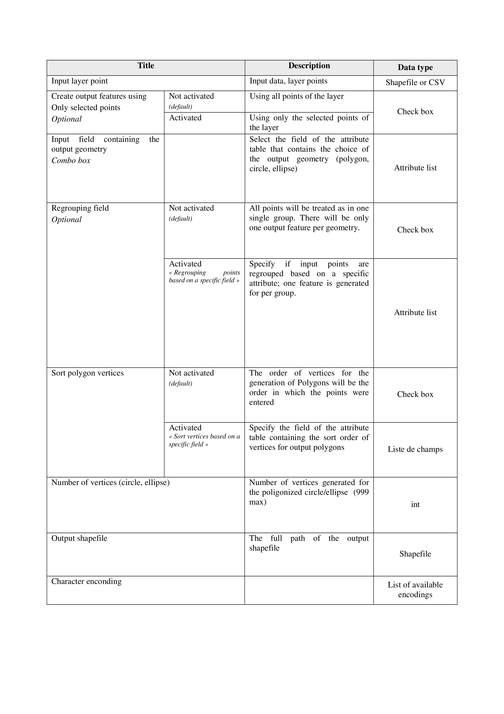

.. archeocad documentation master file, created by
   sphinx-quickstart on Sun Feb 12 17:11:03 2012.
   You can adapt this file completely to your liking, but it should at least
   contain the root `toctree` directive.

ArcheoCAD
============================================

.. toctree::
   :maxdepth: 2

.. index:: Presentation

Presentation
=================
ArcheoCAD is a QGIS plugin that allows creating Polygons, Rectangles, Circles and Ellipses using a layer of points.
In order to do this, the Attribute table of the input layer must have a field containing the desired geometry output.
The values of this attribute, depending on the output geometry, must be chosen from the list below (case-insensitive)

* Ellipse : e, ellipse, elps, o, oval, ovale
* Cercle : c, circle, cercle,  crlc
* Rectangle : r, rectangle, rect
* Polygone : p, polygon, polygone, pg, polyg

There are a few conditions to meet concerning input points during field survey:

* For circles, 2 points on the circumference and a diameter of the circle; 
* For ellipses, 5 points on the circumference (preferably not too close to each other) ;
* For rectangles, 2 points representing the length of the trench.
 
For general polygons, the topographical points which represent vertices must follow one after another on the perimeter (as if we were drawing the polygon on a paper sheet with a pen). If these points were not taken in the correct order, you can add a “sort field” to the attribute table containing a sort order for the output polygons.

.. image:: images/table1.png
	:width: 650pt
	:height: 434pt
	:align: center
	
.. index:: Description of dialog boxes 

Description of dialog boxes 
======================

« Poly-circle-Ellipse » Dialog box 
.....................

.. index:: « Poly-circle-Ellipse » Dialog box

.. image:: images/CercleEllipsePoly.png
	:height: 40pt
	:width: 40pt

.. image:: images/PosterA3.png

« Rectangle » Dialog box
.....................

.. index:: « Rectangle » Dialog box

.. image:: images/Rectangle.png
	:height: 40pt
	:width: 40pt

.. image:: images/table3.png

.. index:: source code

The source code is available at: 

https://github.com/narimanInrap/ArcheoCAD.git

.. Index and tables
==================

.. * :ref:`genindex`

.. * :ref:`modindex`

.. * :ref:`search`

